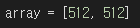
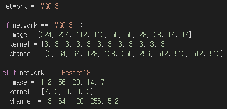

# VW-SDK : An Efficient Convolutional Weight Mapping Algorithm Using Shifted and Duplicated Kernel with Variable Windows.
---
## Abstract
With their high energy efficiency, processing-in-memory (PIM) arrays are increasingly being used for convolutional neural network (CNN) inference. In PIM-based CNN inference, the computational latency and energy are dependent on how the CNN weights are mapped to the PIM array.
A recent study proposed shifted and duplicated kernel (SDK) mapping that reuses the input feature maps with a unit of a parallel window, which is convolved with duplicated kernels to obtain multiple output elements in parallel.
However, the existing SDK-based mapping algorithm does not always result in the minimum computing cycles because it only maps a square-shaped parallel window with the entire channels.
In this paper, we introduce a novel mapping algorithm called variable-window SDK (VW-SDK), which adaptively determines the shape of the parallel window that leads to the minimum computing cycles for a given convolutional layer and PIM array.
By allowing rectangular-shaped windows with partial channels, VW-SDK better utilizes PIM array, thereby further reducing the number of computing cycles.
The simulation with a 512x512 PIM array and Resnet-18 shows that VW-SDK improves the inference speed by 1.69x compared to the existing SDK-based algorithm.

## Requirements
+ python3.x+

## Usage

### main.py
* This code calculates the computing cycle according to the mapping methods (im2col, SDK, VW-SDK).
* You have to input some parameters for calculation using Parser.

### function.py
* This code includes functions for VW-SDK and shows the information of the network and PIM array.

### main.ipynb
* This code calculates the computing cycle according to the mapping methods (im2col, SDK, VW-SDK).

### Example
With list, you have to input the PIM array size.
ex) [rows, columns]

And then, choice the network.

In these form, you can input other networks. 

## Results
These tables show the computing cycles according to the convolutional layer.

We set the array size to 512x512.

### * VGG13

| **Image size** | **Conv layer** | **Im2col** | **SDK** | **VW-SDK** | **Optimal parallel window** |
|:---:|:---:|---:|---:|---:|:---:|
| 224x224 | 3x3x3x64 | 49284 | 12321 | 6216 | 10x3x3x64 |
| 224x224 | 3x3x64x64 | 98568 | 24642 | 24642 | 4x4x32x128 |
| 112x112 | 3x3x64x128 | 24200 | 6050 | 6050 | 4x4x32x128 |
| 112x112 | 3x3x128x128 | 36300 | 36300 | 12100 | 4x4x32x128 |
| 56x56 | 3x3x128x256 | 8748 | 8748 | 5832 | 4x3x42x256 |
| 56x56 | 3x3x256x256 | 14580 | 14580 | 10206 | 4x3x42x256 |

### * Resnet-18

| **Image size** | **Conv layer** | **Im2col** | **SDK** | **VW-SDK** | **Optimal parallel window** |
|:---:|:---:|---:|---:|---:|:---:|
| 112x112 | 7x7x3x64 | 11236 | 2809 | 1431 | 10x8x3x64 |
| 56x56 | 3x3x64x64 | 5832 | 1458 | 1458 | 4x4x32x64 |
| 28x28 | 3x3x128x128 | 2028 | 2028 | 676 | 4x4x32x128 |
| 14x14 | 3x3x256x256 | 720 | 720 | 504 | 4x3x42x256 |
---
## Mapping methods

### Im2col (Image to column)
You can read the original pdf [here](https://dl.acm.org/doi/10.1145/2964284.2967243)

Each kernel with size KxKxIC (where K is kernel, IC is input channel) is unrolled into the column. A kernel-sized window in an input feature map (IFM) is convolved with the kernel.

### SDK (Shift and Duplicate Kernel)
You can read the original pdf [here](https://ieeexplore.ieee.org/document/9104658)

This mapping computes multiple windows instead of single window simultaneously in each cycle. To reuses the input data, this method forms the parallel window that is a set of windows. Thus, it obtains multiple output feature maps (OFMs) by utilizing the PIM array.

---
## Convolutional Neural Network (CNN)
### VGGnet
You can read the original pdf [here](https://arxiv.org/abs/1409.1556)

### Resnet
You can read the original pdf [here](https://ieeexplore.ieee.org/document/8246704)

